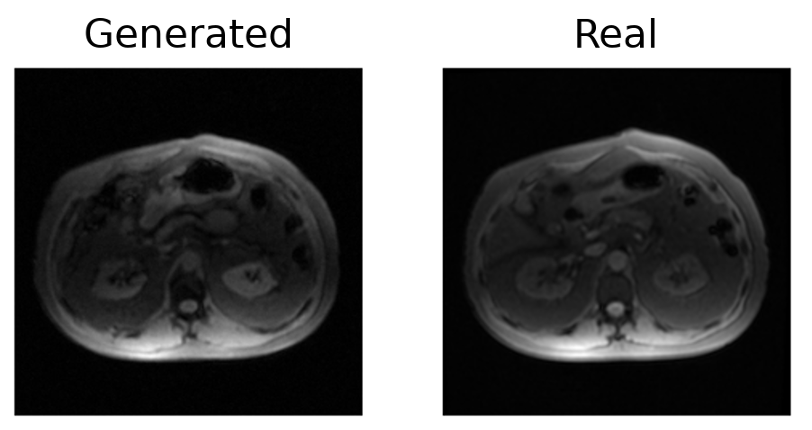

# Generating Liver MRI with a Diffusion Model

Sam Cook, Xiao Shi, Jiayi Tang, Diego Hernando, Ulugbek Kamilov

UW-Madison ECE Summer Program for Advanced Research and Knowledge (SPARK), Summer 2026



## Overview

This project trains a diffusion model to generate realistic, anatomically plausible liver MRI slices, learned from multi-echo clinical data rather than reproduced as memorized copies of real scans. Public ML-ready datasets of multi-echo liver MRI are scarce, and standard augmentation (flips, crops) only reshuffles existing scans without adding new information. A diffusion model instead learns the underlying data distribution, so it can generate genuinely new scans. These generated images can expand training data and act as a learned prior that guides reconstruction and denoising toward realistic results.

The model is a standard DDPM built around the ADM U-Net, operating in the image domain on complex data represented as two channels (real and imaginary).

The work produced two main findings:

1. **Realism.** The model generates recognizable liver anatomy, though not yet at real-scan image quality, as measured by FID (lower is better). Generated samples reached an FID of 34.6, compared to 27.0 for a different real sequence (IDEAL IQ) and 13.8 for real-vs-real.
2. **No memorization.** A nearest-neighbor similarity test found no evidence that the model copies its training data. Generated slices are less similar to the training set (SSIM 0.84 max / 0.67 median) than independent real sequences are (0.91 / 0.70), indicating the model produces new images rather than reproductions.

## Environment setting

### 1) Clone the repository

```
git clone https://github.com/sbcook-ui/mri-diffusion
cd mri-diffusion
```

### 2) Data

The model is trained on a clinical liver MRI dataset from UW-Health (~22,000 complex-valued multi-echo slices). This dataset is not publicly available.

### 3) Virtual environment setup

```
conda create -n mri-diffusion python=3.9
conda activate mri-diffusion
pip install -r requirements.txt
```

## Running the code

### Train

Training modes are selected by flag; each sets the model size, image resolution, and step count.

```
# Tiny CPU smoke test (64x64, 200 steps) - the default if no flag is given
python train.py --smoke

# Full-size architecture, a few hundred steps, to validate the GPU path
python train.py --gputest

# Full training runs (256x256)
python train.py --run100k     # 100k steps, checkpoint every 10k
python train.py --run300k     # 300k steps, checkpoint every 50k
python train.py --full        # 1M steps

# Resume from a checkpoint
python train.py --run300k --resume checkpoints/model_050000.pt
```

### Sample

Generate slices from a trained checkpoint using DDPM ancestral sampling:

```
python sample.py --ckpt checkpoints/model_090000.pt --n 100
```

Outputs magnitude PNG previews plus the raw complex array generated_raw.npy.

### Evaluate

All three evaluation scripts take the generated samples (`generated_raw.npy` from `sample.py`) and compare them against the real training shard.

```
# Nearest-neighbor memorization test (SSIM and PSNR variants)
python memorization_check.py --generated samples/generated_raw.npy \
    --shard data/shards/fam3t_slices.dat --shard_meta data/shards/fam3t_slices.json

python memorization_check_psnr.py --generated samples/generated_raw.npy \
    --shard data/shards/fam3t_slices.dat --shard_meta data/shards/fam3t_slices.json

# Convert generated and real slices to PNGs for FID computation
python fid_prep.py --generated samples/generated_raw.npy \
    --shard data/shards/fam3t_slices.dat --shard_meta data/shards/fam3t_slices.json
```
The paired `.sh` / `.sub` files are HTCondor job scripts for running these on the CHTC cluster (for example `run100k.sub`, `gen100.sub`, `fid.sub`).

## Implementation detail

```
train.py                        # DDPM training loop around the ADM U-Net (mode flags set size/steps)
sample.py                       # DDPM ancestral sampling from a checkpoint; saves PNGs + raw .npy
adm_unet.py                     # Self-contained ADM UNetModel (k-space/coil code stripped)
capture_diffusion.py            # Captures the reverse diffusion process (t=999 -> t=0)
memorization_check.py           # Nearest-neighbor memorization test (SSIM)
memorization_check_psnr.py      # Nearest-neighbor memorization test (PSNR)
fid_prep.py                     # Prepares generated/real images for FID computation
│
├── preprocessing/              # Builds the memory-mapped training shard from raw scans
├── configs/                    # Experiment configuration files
└── scripts/                    # Helper / job scripts
```

## Code references

We build on the [Measurement Score-based diffusion Model (MSM)](https://arxiv.org/abs/2505.11853) framework, from which the ADM U-Net is adapted, which in turn builds on [guided-diffusion](https://github.com/openai/guided-diffusion).

## Data reference

Heidenreich JF, Tang J, Tamada D, Müller L, Grunz JP, do Vale Souza R, Anagnostopoulos A, Pirasteh A, Reeder SB, Hernando D. Motion-Insensitive Flip Angle Modulated Liver Proton Density Fat-Fraction and R2* Mapping During Free-Breathing MRI in a Clinical Setting. *J Magn Reson Imaging*. 2025 Nov;62(5):1452-1463. doi:10.1002/jmri.70033